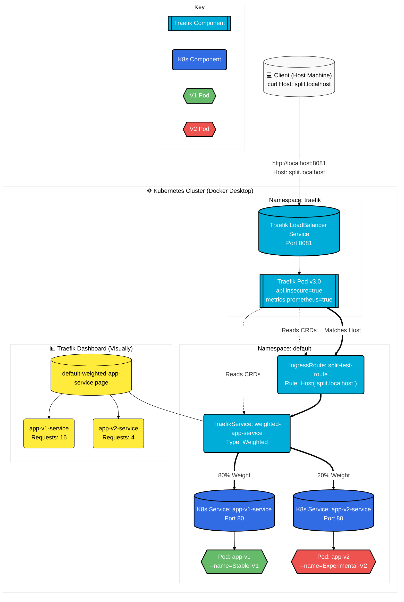

# Traefik Weighted Load Balancing on Kubernetes (Local Dev)

This project demonstrates how to set up **Traefik v3** on a local Kubernetes cluster (Docker Desktop) to perform **Weighted Round Robin (80/20 split)** routing between two versions of an application. 

Perfect for testing Canary deployments or A/B testing locally.



## 🚀 Prerequisites

- **Docker Desktop** with Kubernetes enabled.
- **Helm** (Kubernetes Package Manager).
- **kubectl** CLI installed and configured to point to `docker-desktop`.

---

## 🛠️ 1. Infrastructure Setup (Traefik)

We install Traefik via Helm. The HTTP port is mapped to **8081** to avoid conflicts with Windows IIS or other default services running on port 80.

```powershell
# 1. Add Traefik Repo
helm repo add traefik [https://traefik.github.io/charts](https://traefik.github.io/charts)
helm repo update

# 2. Install Traefik with Dashboard and Metrics enabled
helm install traefik traefik/traefik `
  --create-namespace `
  --namespace traefik `
  --set ports.web.exposedPort=8081 `
  --set "additionalArguments={--api.dashboard=true,--api.insecure=true,--metrics.prometheus=true}"
```

---

## 📦 2. Deploy the Applications

Save the following YAML as `apps.yaml`. This creates two deployments and services: **Stable-V1** and **Experimental-V2**.

```yaml
apiVersion: apps/v1
kind: Deployment
metadata:
  name: app-v1
spec:
  replicas: 1
  selector:
    matchLabels:
      app: v1
  template:
    metadata:
      labels:
        app: v1
    spec:
      containers:
      - name: whoami
        image: traefik/whoami
        args: ["--name=Stable-V1"]
---
apiVersion: v1
kind: Service
metadata:
  name: app-v1-service
spec:
  selector:
    app: v1
  ports:
    - protocol: TCP
      port: 80
      targetPort: 80
---
apiVersion: apps/v1
kind: Deployment
metadata:
  name: app-v2
spec:
  replicas: 1
  selector:
    matchLabels:
      app: v2
  template:
    metadata:
      labels:
        app: v2
    spec:
      containers:
      - name: whoami
        image: traefik/whoami
        args: ["--name=Experimental-V2"]
---
apiVersion: v1
kind: Service
metadata:
  name: app-v2-service
spec:
  selector:
    app: v2
  ports:
    - protocol: TCP
      port: 80
      targetPort: 80
```

Apply the applications:
```powershell
kubectl apply -f apps.yaml
```

---

## ⚖️ 3. Configure the 80/20 Traffic Split

Save this as `split-test.yaml`. This uses Traefik's Custom Resource Definitions (`TraefikService` and `IngressRoute`) to route 80% of traffic to V1 and 20% to V2.

```yaml
apiVersion: traefik.io/v1alpha1
kind: TraefikService
metadata:
  name: weighted-app-service
  namespace: default
spec:
  weighted:
    services:
      - name: app-v1-service
        port: 80
        weight: 80
      - name: app-v2-service
        port: 80
        weight: 20
---
apiVersion: traefik.io/v1alpha1
kind: IngressRoute
metadata:
  name: split-test-route
  namespace: default
spec:
  entryPoints:
    - web
  routes:
  - match: Host(`split.localhost`)
    kind: Rule
    services:
    - name: weighted-app-service
      kind: TraefikService
```

Apply the routing rules:
```powershell
kubectl apply -f split-test.yaml
```

---

## 📊 4. Expose the Traefik Dashboard

To view the visual representation of your routing and services, save this as `traefik-dashboard.yaml`:

```yaml
apiVersion: traefik.io/v1alpha1
kind: IngressRoute
metadata:
  name: traefik-dashboard
  namespace: traefik
spec:
  entryPoints:
    - web
  routes:
  - match: Host(`traefik.localhost`)
    kind: Rule
    services:
    - name: api@internal
      kind: TraefikService
```

Apply the dashboard route:
```powershell
kubectl apply -f traefik-dashboard.yaml
```

---

## 🧪 5. Testing and Verification

### 1. Test the Routing Split
Run a loop in PowerShell to hit the endpoint 10 times and watch the 80/20 distribution in action:
```powershell
1..10 | ForEach-Object { curl.exe -s -H "Host: split.localhost" http://localhost:8081 }
```

### 2. Check Raw Prometheus Metrics
Verify the exact hit count processed by Traefik:
```powershell
curl.exe -s http://localhost:8081/metrics | Select-String "traefik_service_requests_total"
```

### 3. Access the Dashboard
Open your browser and navigate to:
http://traefik.localhost:8081/dashboard/ *(Note: The trailing slash is required!)*

Go to **HTTP -> Services -> default-weighted-app-service** to see the visual 80/20 breakdown.

---

## 🧹 6. Cleanup

To remove all resources created by this lab:

```powershell
kubectl delete -f traefik-dashboard.yaml
kubectl delete -f split-test.yaml
kubectl delete -f apps.yaml
helm uninstall traefik -n traefik
kubectl delete namespace traefik
```